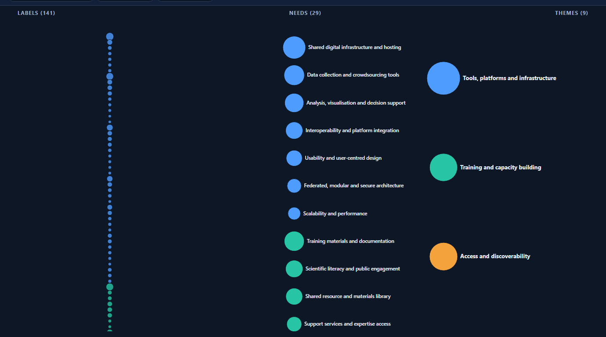
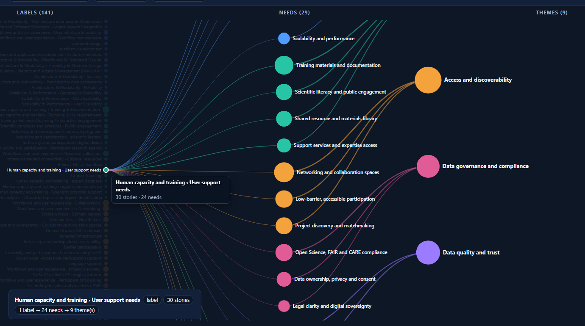
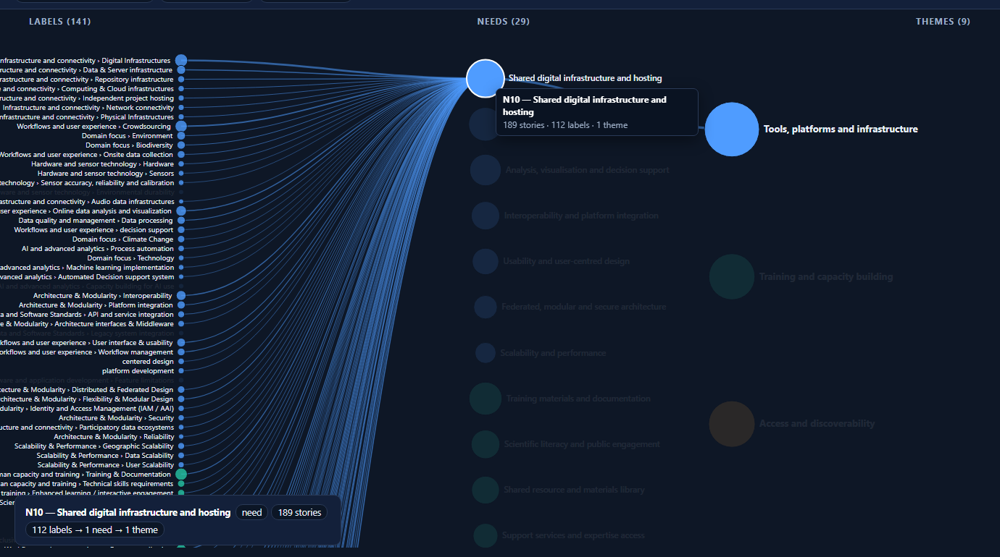
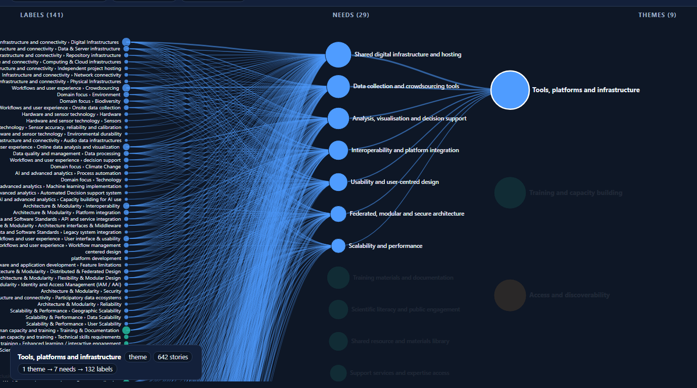

# RIECS — Labels · Needs · Themes explorer

An interactive 2D map of how the RIECS engagement evidence is layered:
**labels → needs → themes**. Click any circle to trace the connections with
Bézier curves, in both directions.

It is a single static page (vanilla **JS + SVG + CSS**, zero dependencies),
ready to publish on GitHub Pages.

> ⚠️ The links are AI-derived from the labelling data and are a **first pass for
> consortium validation** — see [PROVENANCE.md](PROVENANCE.md).

## Overview

Three columns on one surface — **labels** (left), **needs** (centre),
**themes** (right). Circle size = number of stories; colour = theme.



## Examples

### Click a label → the needs it appears in → their themes
Label→need links are **many-to-many**: one label can feed several needs, each of
which carries on to its theme. Here a single training/support label fans out
across needs in different themes.



### Click a need → its labels (left) and its theme (right)
Clicking *N10 — Shared digital infrastructure and hosting* lights up every label
that contributes to it and the theme it rolls up into. Edge thickness reflects
how many stories back each link.



### Click a theme → trace all the way back to the labels
The reverse direction: a theme reveals its needs and, through them, every label
behind it.



Other controls: hover any circle for a tooltip (name + counts), use the **theme
legend** to jump to a theme, the **search** box to find a label/need/theme, and
**Reset** (or click the background) to clear.

## How it works

- Label→need links come from **story co-occurrence**, weighted by the number of
  stories; need→theme is the curated grouping. Counts drive circle size.
- All edges are pre-built as hidden SVG `<path>` elements; interaction only
  toggles CSS classes, so tracing is instant and there is no re-layout.
- ~180 nodes — small enough that plain SVG (not Canvas) is the right tool.

## Data & provenance

The page ships only the **aggregated vocabulary** (labels/needs/themes) and
**story counts** — no personal data and no raw user stories. Full details of the
sources and the build are in **[PROVENANCE.md](PROVENANCE.md)**.

## Structure

```
riecs-needs-explorer/
  build_graph.py        # regenerates docs/data/graph.json from the project data (kept outside the repo)
  PROVENANCE.md
  LICENSE               # GNU GPL v3
  docs/                 # <-- this folder is what GitHub Pages serves
    index.html
    style.css
    app.js
    data/graph.json
    assets/*.png        # screenshots used in this README
```

## Regenerate the data

```bash
python build_graph.py
```

Reads the project's story master spreadsheet (non-rejected stories) and the
curated needs table, and writes `docs/data/graph.json`. Those source files are
**not** part of this repository (see `.gitignore`).
Current size: 141 labels, 29 needs, 9 themes, 2,336 label→need edges.

> Only the 29 themed core needs (N01–N29) are shown; N30–N37 have no theme yet.
> Add a theme to those needs and re-run to include them.

## Preview locally

```bash
cd docs
python -m http.server 8000
# open http://localhost:8000
```

(Must be served over HTTP, not opened as a `file://` — the page fetches
`data/graph.json`.)

## Deploy to GitHub Pages

1. Push this repository to GitHub (suggested name `riecs-needs-explorer`).
2. **Settings → Pages → Build and deployment → Source: Deploy from a branch**,
   branch `main`, folder **`/docs`**.
3. The site goes live at `https://<user>.github.io/riecs-needs-explorer/`.

## License

Source code in this repository is licensed under the **GNU General Public
License v3.0** — see [LICENSE](LICENSE). The vocabulary and aggregate figures are
RIECS-Concept project material; please credit *RIECS-Concept (GA 101188210)*.

## Possible extensions

- Toggle between the many-to-many (co-occurrence) view and the curated 1:1
  `member_labels` hierarchy.
- Filter by audience (D4.2 citizens vs D4.3 stakeholders) or stakeholder group.
- Encode the current selection in the URL hash for shareable deep links.
- Edge-weight threshold slider to thin out weak (single-story) links.

---

*Funded by the European Union (Horizon Europe, GA 101188210). Views and opinions
expressed are those of the authors only.*
